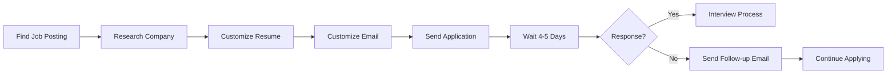
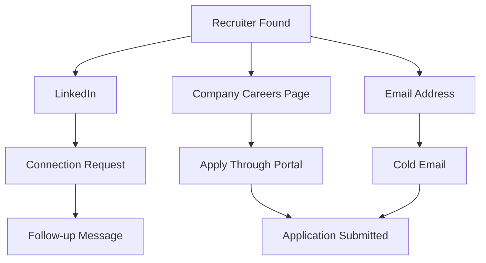
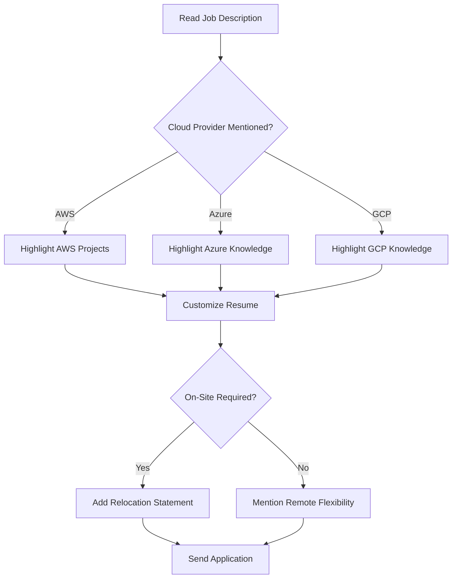
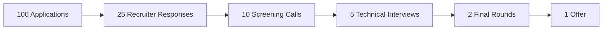
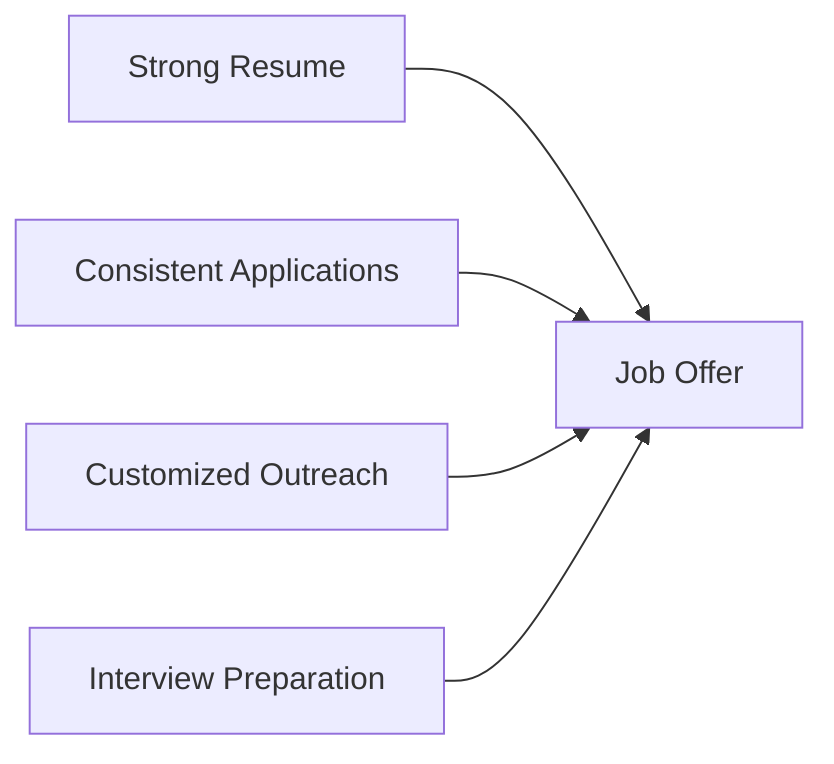

# DevOps / SRE Fresher Cold Email Playbook

## Overview

This document provides a reusable framework for applying to DevOps, SRE, Cloud, Platform Engineering, and Infrastructure roles as a fresher or early-career engineer.

**Target Audience:**

* Freshers (0–1 year experience)
* Candidates with internships
* Junior DevOps Engineers
* Entry-Level SRE Engineers
* Cloud Engineering Aspirants

---

# Application Workflow



---

# Candidate Profile Template

## Candidate Information

| Field                 | Value                     |
| --------------------- | ------------------------- |
| Name                  | Chetan Vani               |
| Degree                | B.Tech                    |
| Experience            | Fresher                   |
| Internship Experience | ~8 Months                 |
| Availability          | Immediate                 |
| Work Preference       | Remote / Hybrid / On-Site |

---

## Core Skills

### CI/CD

* GitHub Actions
* Jenkins

### Containers & Orchestration

* Docker
* Kubernetes

### Infrastructure as Code

* Terraform

### Cloud Platforms

* AWS EC2
* AWS S3
* AWS IAM
* AWS VPC
* AWS CloudWatch

### Monitoring & Observability

* Datadog
* CloudWatch

### Automation

* Bash
* Python

---

# Recruiter Outreach Strategy



---

# Prompt for Generating HR-Ready Emails

Use the following prompt whenever you want ChatGPT to generate a customized application email.

## Email Generation Prompt

```text
Write a concise professional email (subject + body) to the recruiter or hiring manager based on the job posting or HR contact below.

Candidate: Chetan Vani

Education:
- B.Tech

Role:
- DevOps Engineer (Fresher)

Experience:
- ~8 months internship experience

Skills:
- GitHub Actions
- Jenkins
- Docker
- Kubernetes
- Terraform
- AWS (EC2, S3, VPC, IAM, CloudWatch)
- Datadog
- Bash
- Python

Tone:
- Confident
- Concise
- Professional
- No exaggerated claims

Focus:
- Readiness to contribute
- Fast learner
- Immediate availability

Requirements:
- Short subject line
- Mention role and location
- Request next steps
- Mention resume attached
- Maximum 6 short paragraphs

Job Details:
[Paste Job Description Here]
```

---

# Subject Line Templates

## Option 1

```text
DevOps Engineer (Fresher) — Application — [Location]
```

## Option 2

```text
Application: DevOps / SRE (Fresher) — Resume Attached
```

## Option 3

```text
Interested: [Job Title] — Fresher with Hands-On Cloud & CI/CD Experience
```

---

# Standard Cold Email Template

## Subject

```text
DevOps Engineer (Fresher) — Application — [Location]
```

## Email Body

```text
Hello [Name / Hiring Team],

I hope you’re well. I’m Chetan Vani (B.Tech), a DevOps Engineer (Fresher) with hands-on internship experience in CI/CD (GitHub Actions, Jenkins), Docker, Kubernetes, Terraform, and AWS (EC2, S3, VPC, IAM, CloudWatch).

I’m writing to express interest in the [Job Title] role at [Company] and to share my resume for your review.

During my internships, I built and maintained CI/CD pipelines, containerized applications, and provisioned cloud resources using Terraform and AWS. I also worked with monitoring solutions such as Datadog and CloudWatch while automating tasks using Bash and Python.

I am comfortable with remote, hybrid, or on-site work and can join immediately.

If my profile aligns with this role or other junior DevOps/SRE opportunities, I would appreciate the opportunity to discuss next steps through a call, assessment, or interview.

Thank you for your time and consideration.

Best Regards,
Chetan Vani

Phone: [Number]
Email: [Email]
LinkedIn: [Profile]
GitHub: [Profile]
```

---

# Customization Decision Tree



---

# Follow-Up Strategy

## Timeline

| Day     | Action                        |
| ------- | ----------------------------- |
| Day 0   | Send Application              |
| Day 4-5 | First Follow-Up               |
| Day 10  | Second Follow-Up              |
| Day 15  | Move On and Continue Applying |

---

## Follow-Up Email

### Subject

```text
Follow-Up: DevOps Engineer (Fresher) — Chetan Vani
```

### Body

```text
Hello [Name],

I hope you are doing well.

I wanted to follow up regarding my application submitted on [Date] for the [Position Name] role.

I remain interested in the opportunity and would appreciate any updates regarding the hiring process.

Thank you for your time and consideration.

Best Regards,
Chetan Vani
```

---

# Application Funnel Tracker



---

# Recommended Weekly Targets

| Activity              | Target |
| --------------------- | ------ |
| Applications          | 50-100 |
| Recruiter Messages    | 20-30  |
| Follow-Ups            | 15-20  |
| Resume Customizations | 10-15  |
| Mock Interviews       | 2-3    |
| New Projects          | 1      |

---

# Success Formula



## Key Principle

> Apply consistently, customize every application, follow up professionally, and keep improving your technical portfolio while interviewing.
